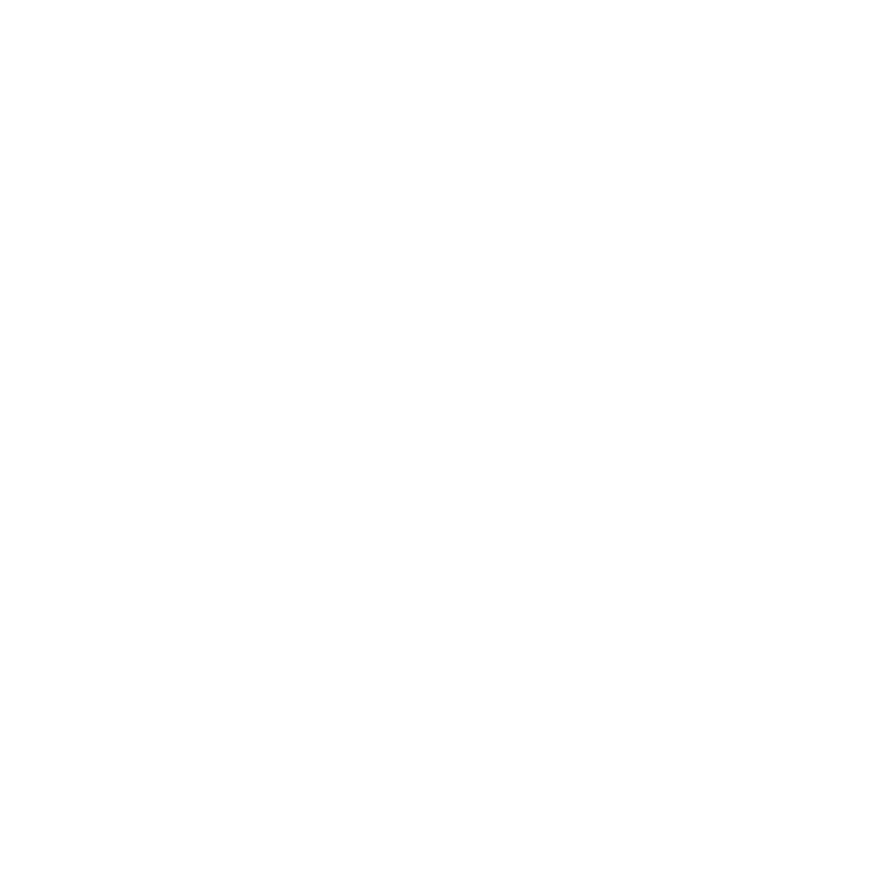
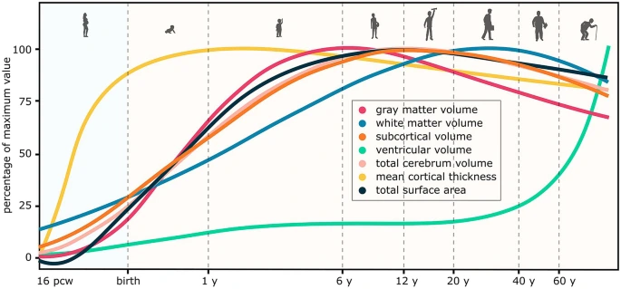
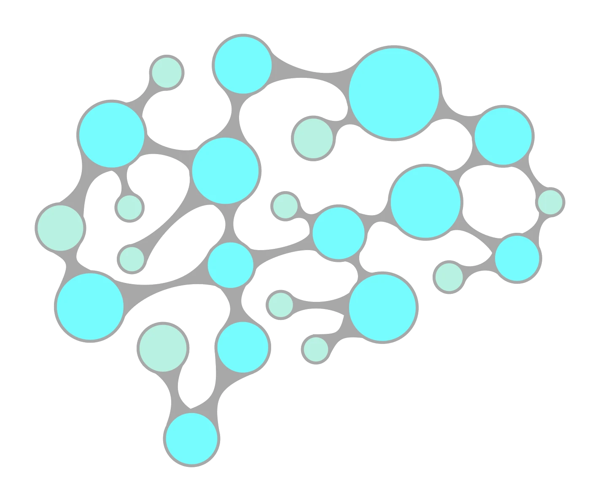
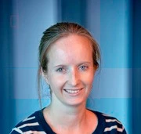

<h1 class="text-3xl font-700 mt-3" style="font-size: 3.2rem; line-height: 1.1;">Mapping Organizational Gradients of Cortical Growth</h1>

Using Spectral Normative Models

 OHBM 2026 &middot; Lifespan Development 

  <a href="https://sina-mansour.github.io/" target="_blank" class="slidev-icon-btn">
    <carbon:user-avatar-filled />
  </a>
  <a href="https://github.com/sina-mansour" target="_blank" class="slidev-icon-btn">
    <carbon:logo-github />
  </a>

  

  
  

    
Sina Mansour L.

    
National University of Singapore

    
University of Melbourne

  

  <carbon:calendar /> 17 June 2026, 15:45  
  <carbon:location /> Room Agora

<!--
Title slide. Keep it to a few seconds: name the work, the session, then move into the motivating question.
-->

---
layout: default
transition: slow-fade
---

# Disclosures

I have <b>no conflicts of interest</b> in relation to this presentation to disclose.

sina-mansour.github.io/OHBM_2026/oral

<myFooter />

<!--
Standard disclosure slide. State it briefly and move on.
-->

---
layout: default
transition: slow-fade
---

# Cortical thickness changes across the lifespan

🧠 Motivation

  <ul class="text-5" v-motion:initial="{ x: -20 }":enter="{ x: -20 }">
    <BulletItem v-click="1" :hide-arrow-at="2">
      Thickness <b>peaks in early childhood</b>, then declines across the lifespan
    </BulletItem>
    <BulletItem v-click="2" :hide-arrow-at="3">
      Shaped by distinct processes: developmental <b>pruning</b> to aging <b>atrophy</b>
    </BulletItem>
    <BulletItem v-click="3">
      Organised macroscopically across the cortex, and if so, how?
    </BulletItem>
  </ul>

  
  
<a href="https://doi.org/10.1038/s41586-022-04554-y" target="_blank">Bethlehem et al. (2022)</a>

<myFooter />

<!--
Open with the question stated explicitly. Cortical thickness follows a clear lifespan trajectory: it peaks in early infancy, before about age 2, and then declines steadily across the rest of life (Bethlehem et al., 2022). This trajectory is shaped by a succession of distinct neurobiological processes, from developmental synaptic pruning and myelination early in life through to atrophy and degeneration in aging. The question that motivates this work: are these processes organised macroscopically across the cortex, and if so, how? Don't dwell; set up and move on.
-->

---
layout: default
transition: slow-fade
---

# Cortical thickness mirrors cortical hierarchies

🧭 Background & gap

  <ul class="text-5" v-motion:initial="{ x: -20 }":enter="{ x: -20 }">
    <BulletItem v-click="1" :hide-arrow-at="3">
      The <b>group-average thickness map</b> mirrors established cortical organisational hierarchies
    </BulletItem>
    <BulletItem v-click="3">
      But how do these associations change across the lifespan?
    </BulletItem>
  </ul>

<!-- Cortical thickness: the anchor map, bottom-left -->
<SlideText :appear-at="2" :cx="28" :cy="56" :w="36">
  

    
Cortical thickness

    
<a href="https://doi.org/10.1038/nature18933" target="_blank">Glasser et al. (2016)</a>

  

</SlideText>
<SlideImage v-click="2" src="./assets/map_CT.webp" :cx="28" :cy="75" :w="30" :h="19" />

<!-- Organisational hierarchies, stacked right -->
<SlideText :appear-at="2" :cx="57" :cy="23" :w="26">
  

    
S-A axis

    
<a href="https://doi.org/10.1016/j.neuron.2021.06.016" target="_blank">Sydnor et al. (2021)</a>

  

</SlideText>
<SlideImage v-click="2" src="./assets/map_SA.webp" :cx="82" :cy="26" :w="22" :h="14" />

<SlideText :appear-at="2" :cx="57" :cy="41" :w="26">
  

    
Functional gradient PC1

    
<a href="https://doi.org/10.1073/pnas.1608282113" target="_blank">Margulies et al. (2016)</a>

  

</SlideText>
<SlideImage v-click="2" src="./assets/map_FCG1.webp" :cx="82" :cy="44" :w="22" :h="14" />

<SlideText :appear-at="2" :cx="54" :cy="59" :w="32">
  

    
Gene expression PC1

    
<a href="https://doi.org/10.1038/s41593-018-0195-0" target="_blank">Burt et al. (2018)</a>; <a href="https://doi.org/10.1038/s41593-024-01624-4" target="_blank">Dear et al. (2024)</a>

  

</SlideText>
<SlideImage v-click="2" src="./assets/map_GEC1_flipped.webp" :cx="82" :cy="62" :w="22" :h="14" />

<SlideText :appear-at="2" :cx="57" :cy="77" :w="26">
  

    
Cytoarchitecture

    
<a href="https://doi.org/10.1093/brain/121.6.1013" target="_blank">Mesulam (1998)</a>

  

</SlideText>
<SlideImage v-click="2" src="./assets/map_mesulam.webp" :cx="82" :cy="80" :w="22" :h="14" />

<myFooter />

<!--
The static, group-average spatial map of cortical thickness is well known to be associated with the cortex's organisational hierarchies. As you can see here, the average thickness map shares a strikingly similar spatial layout with the sensorimotor-to-association axis, the principal functional connectivity gradient, the principal axis of cortical gene expression, and laminar cytoarchitectonic classes. This convergence points to a deeply structured organisation of cortical biology. What we don't yet know is how these associations change across the lifespan, as developmental pruning and aging atrophy reshape the cortex over time. That is the gap this work addresses.
-->

---
layout: default
transition: slow-fade
---

# Spectral Normative Modelling (SNM)

⚙️ Method

<ul class="text-5" v-motion:initial="{ x: -20 }":enter="{ x: -20 }">
  <BulletItem v-click="1" :hide-arrow-at="2">
    A <b>graph-spectral extension</b> of classical normative modelling, enabling efficient vertex-level inference of normative ranges
  </BulletItem>
  <BulletItem v-click="2">
    Thickness encoded in a <b>connectome eigenmode</b> basis, then normative fitting that can be probed at arbitrary resolutions (any combination of vertices)
  </BulletItem>
</ul>

<SlideImage v-click="[1,2]" src="./assets/snm.webp" :cx="50" :cy="63" :w="54" :h="53" />

<myFooter />

<!--
We recently developed Spectral Normative Modelling (SNM). It builds on conventional normative modelling but introduces a graph-spectral representation of the cortex, making vertex-resolution inference tractable and spatially aware. We represent the cortex using a small set of structural-connectome eigenmodes, project cortical thickness into that basis, and fit a hierarchical Bayesian normative model jointly across modes. Applied to 78,405 quality-controlled scans across 30 datasets and 189 sites, ages 5 to 95. I won't go through the method in detail today; the goal is what we learn from the model. Happy to discuss after, and full details are in the poster and preprint. Call out 78,405 explicitly.
-->

---
layout: default
transition: slow-fade
---

# SNM training

🧪 Structural MRI sample

<ul class="text-5" v-motion:initial="{ x: -20 }":enter="{ x: -20 }">
  <BulletItem v-click="1" :hide-arrow-at="2">
    SNM was trained on a large, lifespan structural MRI sample
  </BulletItem>
  <BulletItem v-click="2">
    <b>78,405</b> QC'd scans &middot; <b>30</b> datasets &middot; <b>189</b> sites &middot; ages <b>5 to 95</b>
  </BulletItem>
</ul>

<SlideImage v-click="1" src="./assets/sample.webp" :cx="50" :cy="62" :w="88" :h="47" />

<myFooter />

<!--
SNM was trained on a large, quality-controlled lifespan structural MRI sample: 78,405 scans drawn from 30 datasets and 189 sites, spanning ages 5 to 95. This scale is what makes vertex-resolution normative inference across the whole lifespan possible, and it is a real credibility multiplier. Call out the 78,405 figure explicitly.
-->

---
layout: default
transition: slow-fade
---

# Vertex-resolution normative estimates

🗺️ SNM outputs

<ul class="text-5" v-click="[1,2]" v-motion:initial="{ x: -20 }":enter="{ x: -20 }">
  <BulletItem v-click="1" :hide-arrow-at="2">
    At any age, SNM estimates the <b>mean</b> thickness, <b>inter-individual variability</b>, and the <b>annual % rate of change</b> at every vertex.
  </BulletItem>
</ul>

<SlideImage v-click="[1,2]" src="./assets/vertex.webp" :cx="50" :cy="58" :w="83" :h="39" />

<SlideImage v-click="2" src="./assets/lifespan.webp" :cx="50" :cy="55" :w="82" :h="67" />

<myFooter />

<!--
Once SNM is trained, the model gives vertex-resolution normative estimates of three things at any age: the mean cortical thickness, the inter-individual variability around that mean, and crucially the annual percent rate of change. Here is how those estimates look across the lifespan. Already you can see hints of organisational structure: regional differences in mean thickness, where variability concentrates, and which regions change fastest at different ages. Let the figure breathe; don't talk about gradients yet.
-->

---
layout: default
transition: slow-fade
---

# Thickness Growth Gradients

🌟 From trajectories to gradients

<SlideText :appear-at="1" :disappear-at="2" :cx="38" :cy="34" :w="60" :h="24">
  
<b>PCA</b> on vertex trajectories: <b>3 gradients</b> explain <b>over 90%</b> of variance, the <b>Thickness Growth Gradients</b> (TGG1 to TGG3)

</SlideText>

<SlideImage v-click="[1,5]" src="./assets/tgg_components.webp" :cx="82" :cy="52" :w="19" :h="81" :x0="0" :x1="0.21" :y0="0" :y1="1" />

<SlideText :appear-at="2" :disappear-at="3" :cx="38" :cy="34" :w="60" :h="24">
  
SNM answers <b>arbitrary post-hoc queries</b> on the trained model

</SlideText>

<SlideText :appear-at="3" :disappear-at="4" :cx="38" :cy="34" :w="60" :h="24">
  
Define spatial <b>strata</b> along each gradient's centiles

</SlideText>

<SlideImage v-click="[3,4]" src="./assets/strata_characteristics_TGG1.webp" :cx="40" :cy="62" :w="44" :h="52" />

<SlideText :appear-at="4" :cx="38" :cy="34" :w="60" :h="24">
  
Query <b>normative trajectories</b> within each stratum

</SlideText>

<SlideImage v-click="[4,5]" src="./assets/strata_charts_TGG1.webp" :cx="40" :cy="62" :w="44" :h="52" />

<myFooter />

<!--
To make sense of these vertex-wise trajectories, we applied PCA. Three components together explain over 90% of the variance: the Thickness Growth Gradients, TGG1, TGG2 and TGG3. In the rest of the talk I'll characterise each and link it to existing cortical hierarchies. One thing worth flagging: SNM lets us probe arbitrary post-hoc normative questions on the pretrained model. To interpret a gradient, we define spatially delineated strata along it and query the normative trajectory within each stratum. That's the engine behind the trajectory plots coming up. Let the visual carry the load.
-->

---
layout: default
transition: slow-fade
---

# TGG1: stable global organisation

1️⃣ Age-invariant axis

<SlideImage v-click="1" src="./assets/tgg1_row.webp"
  :cx="17.5" :cy="53" :w="17.2" :h="26"
  :x0="0" :x1="0.209" :y0="0" :y1="1"
  :cropStates="{ 1: { x1: 0.209 }, 2: { x1: 0.395 }, 3: { x1: 0.597 }, 5: { x1: 0.80 }, 6: { x1: 1.0 } }"
  :containerStates="{ 1: { cx: 17.5, w: 17.2 }, 2: { cx: 25.15, w: 32.5 }, 3: { cx: 33.45, w: 49.1 }, 5: { cx: 41.8, w: 65.8 }, 6: { cx: 50.0, w: 82.2 } }" />

<SlideImage v-click="1" src="./assets/value_cbar.webp" :cx="18.5" :cy="67" :w="16" :h="6.05" />
<SlideImage v-click="2" src="./assets/centile_cbar.webp" :cx="33.72" :cy="67" :w="15" :h="5.94" />

<!-- sketched red box around the thickness plot (column 3) -->

<SlideText :appear-at="1" :disappear-at="2" :cx="50" :cy="29" :w="84">
  
Values along <b>Thickness Growth Gradient 1</b>

</SlideText>
<SlideText :appear-at="2" :disappear-at="3" :cx="50" :cy="29" :w="84">
  
Converting values to <b>centiles</b>

</SlideText>
<SlideText :appear-at="3" :disappear-at="5" :cx="50" :cy="29" :w="84">
  
<b>Mean thickness</b> estimates for each stratum along the gradient

</SlideText>
<SlideText :appear-at="5" :disappear-at="6" :cx="50" :cy="29" :w="84">
  
<b>Percent change rate</b> along the gradient strata

</SlideText>
<SlideText :appear-at="6" :cx="50" :cy="29" :w="84">
  
Association with the <b>average cortical thickness map</b> (<a href="https://doi.org/10.1038/nature18933" target="_blank">Glasser et al. 2016</a>)

</SlideText>

<myFooter />

<!--
TGG1 captures the stable, age-invariant axis of cortical thickness organisation: paralimbic and association cortices at one end, primary sensorimotor at the other. It correlates with mean cortical thickness at r = 0.91, recapitulating the canonical sensorimotor-to-association hierarchy across the entire lifespan.
-->

---
layout: default
transition: slow-fade
---

# TGG2: aging-related thinning

2️⃣ Late-life decline

<SlideImage v-click="1" src="./assets/tgg2_row.webp"
  :cx="15.4" :cy="53" :w="18.3" :h="26"
  :x0="0" :x1="0.209" :y0="0" :y1="1"
  :cropStates="{ 1: { x1: 0.209 }, 2: { x1: 0.395 }, 3: { x1: 0.597 }, 4: { x1: 0.80 }, 6: { x1: 1.0 } }"
  :containerStates="{ 1: { cx: 15.4, w: 18.3 }, 2: { cx: 23.5, w: 34.6 }, 3: { cx: 32.4, w: 52.3 }, 4: { cx: 41.25, w: 70.0 }, 6: { cx: 50.0, w: 87.5 } }" />

<SlideImage v-click="1" src="./assets/value_cbar.webp" :cx="16.4" :cy="67" :w="16" :h="6.05" />
<SlideImage v-click="2" src="./assets/centile_cbar.webp" :cx="32.68" :cy="67" :w="15" :h="5.94" />

<!-- sketched red box around the change-rate plot (column 4) -->

<SlideText :appear-at="1" :disappear-at="2" :cx="50" :cy="29" :w="84">
  
Values along <b>Thickness Growth Gradient 2</b>

</SlideText>
<SlideText :appear-at="2" :disappear-at="3" :cx="50" :cy="29" :w="84">
  
Converting values to <b>centiles</b>

</SlideText>
<SlideText :appear-at="3" :disappear-at="4" :cx="50" :cy="29" :w="84">
  
<b>Mean thickness</b> estimates for each stratum along the gradient

</SlideText>
<SlideText :appear-at="4" :disappear-at="6" :cx="50" :cy="29" :w="84">
  
<b>Percent change rate</b> along the gradient strata

</SlideText>
<SlideText :appear-at="6" :cx="50" :cy="29" :w="84">
  
Association with <b>aging-related thickness decline</b>

</SlideText>

<myFooter />

<!--
TGG2 isolates aging-related thinning, concentrated in premotor and superior temporal regions. It correlates strongly with our Aging Thickness Decline map (r = 0.88) and aligns with a transcriptional component enriched for metabolic processes.
-->

---
layout: default
transition: slow-fade
---

# TGG3: developmental pruning

3️⃣ Early-life thinning

<SlideImage v-click="1" src="./assets/tgg3_row.webp"
  :cx="16.98" :cy="53" :w="17.45" :h="26"
  :x0="0" :x1="0.209" :y0="0" :y1="1"
  :cropStates="{ 1: { x1: 0.209 }, 2: { x1: 0.395 }, 3: { x1: 0.597 }, 4: { x1: 0.80 }, 6: { x1: 1.0 } }"
  :containerStates="{ 1: { cx: 16.98, w: 17.45 }, 2: { cx: 24.74, w: 32.99 }, 3: { cx: 33.18, w: 49.86 }, 4: { cx: 41.65, w: 66.81 }, 6: { cx: 50.0, w: 83.51 } }" />

<SlideImage v-click="1" src="./assets/value_cbar.webp" :cx="17.98" :cy="67" :w="16" :h="6.05" />
<SlideImage v-click="2" src="./assets/centile_cbar.webp" :cx="33.48" :cy="67" :w="15" :h="5.94" />

<!-- sketched red box around the change-rate plot (column 4) -->

<SlideText :appear-at="1" :disappear-at="2" :cx="50" :cy="29" :w="84">
  
Values along <b>Thickness Growth Gradient 3</b>

</SlideText>
<SlideText :appear-at="2" :disappear-at="3" :cx="50" :cy="29" :w="84">
  
Converting values to <b>centiles</b>

</SlideText>
<SlideText :appear-at="3" :disappear-at="4" :cx="50" :cy="29" :w="84">
  
<b>Mean thickness</b> estimates for each stratum along the gradient

</SlideText>
<SlideText :appear-at="4" :disappear-at="6" :cx="50" :cy="29" :w="84">
  
<b>Percent change rate</b> along the gradient strata

</SlideText>
<SlideText :appear-at="6" :cx="50" :cy="29" :w="84">
  
Association with <b>developmental cortical pruning</b>

</SlideText>

<myFooter />

<!--
TGG3 captures early-life developmental pruning: sharp thinning in primary and unimodal cortex during ages 5 to 20, correlating with our Developmental Cortical Pruning map at r = -0.76. It aligns with a gene expression component enriched for synaptic plasticity. Slides 4c-4e share the same visual template; the repetition makes the three-gradient story land.
-->

---
layout: default
transition: slow-fade
---

# Cytoarchitectonic alignment

🔬 From idiotypic to paralimbic

<ul class="text-5" v-motion:initial="{ x: -20 }":enter="{ x: -20 }">
  <BulletItem v-click="1" :hide-arrow-at="2">
    Each TGG aligns with the cortex's <b>laminar cytoarchitectonic hierarchy</b> (<a href="https://doi.org/10.1093/brain/121.6.1013" target="_blank">Mesulam, 1998</a>)
  </BulletItem>
</ul>

<SlideImage v-click="1" src="./assets/laminar_cytoarchitecture.webp" :cx="50" :cy="56" :w="84" :h="38" />

<SlideText :appear-at="1" :cx="50" :cy="86" :w="80" :h="12">
  
All three omnibus tests survive FDR correction using spatial-autocorrelation-preserving nulls.

</SlideText>

<myFooter />

<!--
Each gradient aligns with the cortex's established laminar cytoarchitectonic hierarchy, both Mesulam's laminar differentiation levels and Von Economo cell-type classes. This places the TGGs within a well-known organisational framework of cortical microstructure. All three omnibus tests survive FDR correction using BrainSMASH spatial-autocorrelation-preserving nulls, so the alignment is statistically robust. Lead with the alignment; mention BrainSMASH and FDR to anticipate methods questions.
-->

---
layout: default
transition: slow-fade
---

# Convergence with cortical hierarchies

🧩 Colocating with established hierarchies across modalities

<SlideImage v-click="1" src="./assets/cluster_convergence.webp" :cx="50" :cy="57" :w="44" :h="63" />

<myFooter />

<!--
The thickness growth gradients colocate with previously established cortical hierarchies spanning several modalities. Each TGG anchors a distinct cluster: TGG1 with mean cortical thickness, the sensorimotor-association axis, functional and gene-expression gradients; TGG2 with the aging thickness decline and its own functional and transcriptional partners; and TGG3 with developmental cortical pruning and gene-expression component 3. The convergence of normative, anatomical, functional, genetic and diffusion maps within each cluster suggests these are genuine organisational axes of cortical biology, not just statistical decompositions.
-->

---
layout: default
transition: slow-fade
---

# Normative retrogenesis

🔄 Development vs. aging

<ul class="text-5" v-motion:initial="{ x: -20 }":enter="{ x: -20 }">
  <BulletItem v-click="1" :hide-arrow-at="2">
    The cortical rates of normative thickness change <b>reverse patterns</b> in development vs. aging
  </BulletItem>
</ul>

<SlideImage v-click="[2,3]" src="./assets/retrogenesis.webp" :cx="50" :cy="57" :w="28" :h="49" />

<SlideText :appear-at="2" :disappear-at="3" :cx="50" :cy="86" :w="84" :h="12">
  
Regions most <b>stable in development</b> are amongst those <b>steeply declining in aging</b>.

</SlideText>

<SlideImage v-click="3" src="./assets/normative_rate_comparison.webp" :cx="50" :cy="52" :w="88" :h="55" />

<SlideText :appear-at="3" :cx="50" :cy="86" :w="88" :h="12">
  
<b>TGG3</b> captures the aspects of development that reverse in aging.

</SlideText>

<myFooter />

<!--
One striking result ties this together: the cortical rates of normative thickness change reverse between development and aging. The developmental cortical pruning map and the aging thickness decline map are anticorrelated (r = -0.43, p_spin = 0.017). In other words, the regions most stable during development are amongst those declining most steeply in aging. Pause briefly here. This is a normative, lifespan-wide expression of the retrogenesis hypothesis, and points to gene-expression patterns that may underlie the asymmetry. Land this firmly, don't rush.
-->

---
layout: default
transition: slow-fade
---

# Take-home messages

🎯 Conclusions

  <ul class="text-5" v-motion:initial="{ x: -20 }":enter="{ x: -20 }">
    <BulletItem v-click="1" :hide-arrow-at="2">
      <b>SNM</b> makes lifespan vertex-resolution brain charting tractable
    </BulletItem>
    <BulletItem v-click="2" :hide-arrow-at="3">
      Thickness change resolves into <b>three growth gradients</b> (TGG1 to TGG3)
    </BulletItem>
    <BulletItem v-click="3" :hide-arrow-at="4">
      Each gradient recapitulates <b>established cortical hierarchies</b>: function, genetics, and cytoarchitecture
    </BulletItem>
    <BulletItem v-click="4">
      Development and aging are coupled by a normative retrogenesis
    </BulletItem>
  </ul>

<SlideImage v-click="1" src="./assets/tgg_components.webp" :cx="82" :cy="52" :w="19" :h="81" :x0="0" :x1="0.21" :y0="0" :y1="1" />

<myFooter />

<!--
To wrap up the findings. First, Spectral Normative Modelling makes vertex-resolution normative inference tractable and spatially aware across the entire lifespan. Second, when we decompose those lifespan trajectories, cortical thickness change resolves into just three growth gradients that together explain over ninety percent of the variance. Third, each gradient recapitulates established organisational hierarchies of the cortex, spanning function, gene expression and laminar cytoarchitecture, so these are genuine biological axes rather than statistical artefacts. And finally, development and aging are coupled: the regions most stable in development are those declining most steeply in aging, a normative, lifespan-wide expression of retrogenesis.
-->

---
layout: default
transition: slow-fade
---

# Code & Data Availability

⚡ Openly available resources

<SlideImage v-click="1" src="./assets/SpectraNorm.webp" :cx="20" :cy="33" :w="15" :h="24" />
<SlideImage v-click="1" src="./assets/spectranormQR.png" :cx="20" :cy="63" :w="25" :h="40" />
<SlideText :appear-at="1" :cx="20" :cy="95" :w="20" :h="25">
  
Python Package

</SlideText>

<SlideImage v-click="2" src="./assets/repoQR.png" :cx="50" :cy="63" :w="25" :h="40" />
<SlideText :appear-at="2" :cx="50" :cy="95" :w="20" :h="25">
  
GitHub Repository

</SlideText>

<SlideImage v-click="3" src="./assets/preprintQR.png" :cx="80" :cy="63" :w="25" :h="40" />
<SlideText :appear-at="3" :cx="80" :cy="95" :w="20" :h="25">
  
Preprint

</SlideText>

<myFooter />

<!--
To summarise before closing: SNM lets us decompose lifespan cortical thickness into three interpretable, biologically grounded gradients: stable organisation, aging-related thinning, and developmental pruning. The latter two are anticorrelated in a way that supports retrogenesis at the gradient level. Full poster, code and details are at these QR codes: the SpectraNorm Python package, the GitHub repository, and the preprint.
-->

---
layout: default
transition: fade-out
---

# Acknowledgements

  

  
  
  
  
  
  
  
  
  
  
  
  
  
  
  
  
  
  

National University of Singapore

<b>B.T. Thomas Yeo</b>, Christopher Chen, Woon-Puay Koh, Aihuiping Xue, Shaoshi Zhang, Joanna Chong, Zhang Yichi, Eric Ng, Teng Yinghui, Juan Helen Zhou, Ai Peng Tan, Hongwei Yan, Chen Zhang, Tian Fang, Niousha Dehestani, Ji Fang, Xing Qian

University of Melbourne

<b>Andrew Zalesky</b>, Maria Di Biase, Vanessa Cropley

NUHS

Yap Seng Chong, N. Venketasubramanian, Eddie Chong

CHOP

Aaron Alexander-Bloch, Jakob Seidlitz

EPFL

Dimitri Van De Ville, Hamid Behjat

Cambridge

Richard Bethlehem

Florey

Robert E. Smith

  Thank You!  

sina-mansour.github.io/OHBM_2026/oral

<myFooter />

<!--
Huge thanks to my collaborators at NUS and Melbourne, particularly Thomas Yeo and Andrew Zalesky, and to the Lifespan Brain Chart Consortium for making this scale of analysis possible. Happy to take questions.
-->
